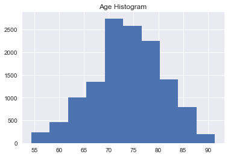
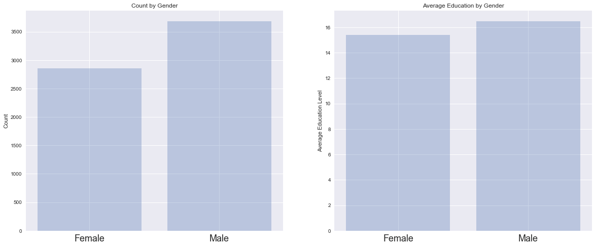
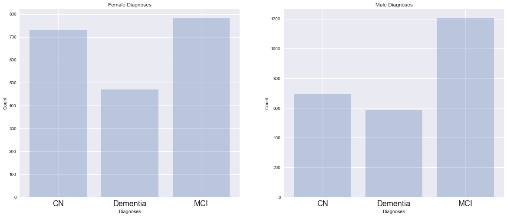
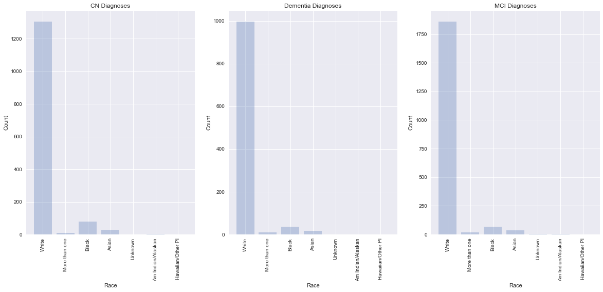
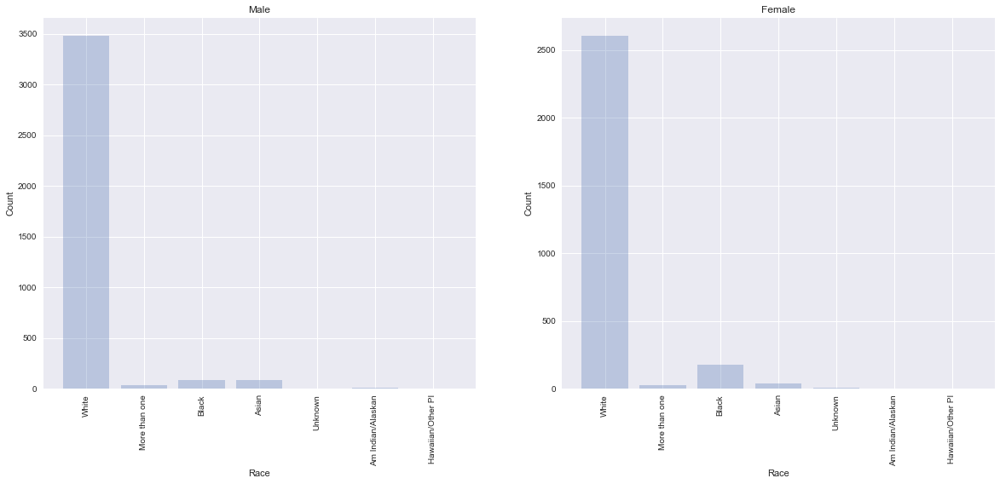

## Contents
{:.no_toc}
*  
{: toc}


Import libraries:


```python
import numpy as np
import pandas as pd
import matplotlib
import matplotlib.pyplot as plt
from sklearn.linear_model import LogisticRegressionCV
import sklearn.metrics as metrics
from sklearn.preprocessing import PolynomialFeatures
from sklearn.discriminant_analysis import LinearDiscriminantAnalysis
from sklearn.discriminant_analysis import QuadraticDiscriminantAnalysis
from sklearn.neighbors import KNeighborsClassifier
from sklearn.tree import DecisionTreeClassifier
from sklearn.model_selection import cross_val_score
#import pydotplus
#import io
from sklearn.tree import export_graphviz
from IPython.display import Image
from IPython.display import display
from matplotlib import colors
import seaborn as sns
%matplotlib inline
```


```python
np.random.seed(9001)

df = pd.read_csv('ADNIMERGE.csv')

categorical_col = ['DX', 'PTGENDER']

df = pd.get_dummies(df, columns=categorical_col)

all_variables_dum = list(df.columns.values)
```


```python
msk = np.random.rand(len(df)) < 0.5
df_train = df[msk]
df_test = df[~msk]
```


```python
df.head()
```


<div>
<style>
    .dataframe thead tr:only-child th {
        text-align: right;
    }

    .dataframe thead th {
        text-align: left;
    }

    .dataframe tbody tr th {
        vertical-align: top;
    }
</style>
<table border="1" class="dataframe">
  <thead>
    <tr style="text-align: right;">
      <th></th>
      <th>RID</th>
      <th>PTID</th>
      <th>VISCODE</th>
      <th>SITE</th>
      <th>COLPROT</th>
      <th>ORIGPROT</th>
      <th>EXAMDATE</th>
      <th>DX_bl</th>
      <th>AGE</th>
      <th>PTEDUCAT</th>
      <th>...</th>
      <th>Years_bl</th>
      <th>Month_bl</th>
      <th>Month</th>
      <th>M</th>
      <th>update_stamp</th>
      <th>DX_CN</th>
      <th>DX_Dementia</th>
      <th>DX_MCI</th>
      <th>PTGENDER_Female</th>
      <th>PTGENDER_Male</th>
    </tr>
  </thead>
  <tbody>
    <tr>
      <th>0</th>
      <td>2</td>
      <td>011_S_0002</td>
      <td>bl</td>
      <td>11</td>
      <td>ADNI1</td>
      <td>ADNI1</td>
      <td>2005-09-08</td>
      <td>CN</td>
      <td>74.3</td>
      <td>16</td>
      <td>...</td>
      <td>0.000000</td>
      <td>0.00000</td>
      <td>0</td>
      <td>0</td>
      <td>2017-08-13 23:50:48.0</td>
      <td>1</td>
      <td>0</td>
      <td>0</td>
      <td>0</td>
      <td>1</td>
    </tr>
    <tr>
      <th>1</th>
      <td>3</td>
      <td>011_S_0003</td>
      <td>bl</td>
      <td>11</td>
      <td>ADNI1</td>
      <td>ADNI1</td>
      <td>2005-09-12</td>
      <td>AD</td>
      <td>81.3</td>
      <td>18</td>
      <td>...</td>
      <td>0.000000</td>
      <td>0.00000</td>
      <td>0</td>
      <td>0</td>
      <td>2017-08-13 23:50:48.0</td>
      <td>0</td>
      <td>1</td>
      <td>0</td>
      <td>0</td>
      <td>1</td>
    </tr>
    <tr>
      <th>2</th>
      <td>3</td>
      <td>011_S_0003</td>
      <td>m06</td>
      <td>11</td>
      <td>ADNI1</td>
      <td>ADNI1</td>
      <td>2006-03-13</td>
      <td>AD</td>
      <td>81.3</td>
      <td>18</td>
      <td>...</td>
      <td>0.498289</td>
      <td>5.96721</td>
      <td>6</td>
      <td>6</td>
      <td>2017-08-13 23:50:48.0</td>
      <td>0</td>
      <td>1</td>
      <td>0</td>
      <td>0</td>
      <td>1</td>
    </tr>
    <tr>
      <th>3</th>
      <td>3</td>
      <td>011_S_0003</td>
      <td>m12</td>
      <td>11</td>
      <td>ADNI1</td>
      <td>ADNI1</td>
      <td>2006-09-12</td>
      <td>AD</td>
      <td>81.3</td>
      <td>18</td>
      <td>...</td>
      <td>0.999316</td>
      <td>11.96720</td>
      <td>12</td>
      <td>12</td>
      <td>2017-08-13 23:50:48.0</td>
      <td>0</td>
      <td>1</td>
      <td>0</td>
      <td>0</td>
      <td>1</td>
    </tr>
    <tr>
      <th>4</th>
      <td>3</td>
      <td>011_S_0003</td>
      <td>m24</td>
      <td>11</td>
      <td>ADNI1</td>
      <td>ADNI1</td>
      <td>2007-09-12</td>
      <td>AD</td>
      <td>81.3</td>
      <td>18</td>
      <td>...</td>
      <td>1.998630</td>
      <td>23.93440</td>
      <td>24</td>
      <td>24</td>
      <td>2017-08-13 23:50:48.0</td>
      <td>0</td>
      <td>1</td>
      <td>0</td>
      <td>0</td>
      <td>1</td>
    </tr>
  </tbody>
</table>
<p>5 rows × 97 columns</p>
</div>


```python
df.describe()
```


<div>
<style>
    .dataframe thead tr:only-child th {
        text-align: right;
    }

    .dataframe thead th {
        text-align: left;
    }

    .dataframe tbody tr th {
        vertical-align: top;
    }
</style>
<table border="1" class="dataframe">
  <thead>
    <tr style="text-align: right;">
      <th></th>
      <th>RID</th>
      <th>SITE</th>
      <th>AGE</th>
      <th>PTEDUCAT</th>
      <th>APOE4</th>
      <th>FDG</th>
      <th>PIB</th>
      <th>AV45</th>
      <th>CDRSB</th>
      <th>ADAS11</th>
      <th>...</th>
      <th>AV45_bl</th>
      <th>Years_bl</th>
      <th>Month_bl</th>
      <th>Month</th>
      <th>M</th>
      <th>DX_CN</th>
      <th>DX_Dementia</th>
      <th>DX_MCI</th>
      <th>PTGENDER_Female</th>
      <th>PTGENDER_Male</th>
    </tr>
  </thead>
  <tbody>
    <tr>
      <th>count</th>
      <td>13017.000000</td>
      <td>13017.000000</td>
      <td>13017.000000</td>
      <td>13017.000000</td>
      <td>12958.000000</td>
      <td>3353.000000</td>
      <td>223.000000</td>
      <td>2161.000000</td>
      <td>9016.000000</td>
      <td>8959.000000</td>
      <td>...</td>
      <td>5969.000000</td>
      <td>13017.000000</td>
      <td>13017.000000</td>
      <td>13017.000000</td>
      <td>13017.000000</td>
      <td>13017.000000</td>
      <td>13017.000000</td>
      <td>13017.000000</td>
      <td>13017.000000</td>
      <td>13017.000000</td>
    </tr>
    <tr>
      <th>mean</th>
      <td>2285.200584</td>
      <td>73.892064</td>
      <td>73.767220</td>
      <td>15.994930</td>
      <td>0.535654</td>
      <td>1.208225</td>
      <td>1.783161</td>
      <td>1.195504</td>
      <td>2.163598</td>
      <td>11.398507</td>
      <td>...</td>
      <td>1.200700</td>
      <td>2.235266</td>
      <td>26.768221</td>
      <td>26.688868</td>
      <td>26.498041</td>
      <td>0.213106</td>
      <td>0.162096</td>
      <td>0.312284</td>
      <td>0.436199</td>
      <td>0.563801</td>
    </tr>
    <tr>
      <th>std</th>
      <td>1871.013213</td>
      <td>110.533877</td>
      <td>6.979685</td>
      <td>2.824862</td>
      <td>0.655480</td>
      <td>0.160972</td>
      <td>0.422511</td>
      <td>0.227999</td>
      <td>2.805879</td>
      <td>8.616859</td>
      <td>...</td>
      <td>0.221538</td>
      <td>2.225071</td>
      <td>26.646135</td>
      <td>26.609785</td>
      <td>26.398907</td>
      <td>0.409518</td>
      <td>0.368553</td>
      <td>0.463443</td>
      <td>0.495932</td>
      <td>0.495932</td>
    </tr>
    <tr>
      <th>min</th>
      <td>2.000000</td>
      <td>2.000000</td>
      <td>54.400000</td>
      <td>4.000000</td>
      <td>0.000000</td>
      <td>0.636804</td>
      <td>1.095000</td>
      <td>0.814555</td>
      <td>0.000000</td>
      <td>0.000000</td>
      <td>...</td>
      <td>0.838537</td>
      <td>0.000000</td>
      <td>0.000000</td>
      <td>0.000000</td>
      <td>0.000000</td>
      <td>0.000000</td>
      <td>0.000000</td>
      <td>0.000000</td>
      <td>0.000000</td>
      <td>0.000000</td>
    </tr>
    <tr>
      <th>25%</th>
      <td>631.000000</td>
      <td>21.000000</td>
      <td>69.500000</td>
      <td>14.000000</td>
      <td>0.000000</td>
      <td>1.109730</td>
      <td>1.361250</td>
      <td>1.010140</td>
      <td>0.000000</td>
      <td>5.330000</td>
      <td>...</td>
      <td>1.018950</td>
      <td>0.498289</td>
      <td>5.967210</td>
      <td>6.000000</td>
      <td>6.000000</td>
      <td>0.000000</td>
      <td>0.000000</td>
      <td>0.000000</td>
      <td>0.000000</td>
      <td>0.000000</td>
    </tr>
    <tr>
      <th>50%</th>
      <td>1301.000000</td>
      <td>41.000000</td>
      <td>73.700000</td>
      <td>16.000000</td>
      <td>0.000000</td>
      <td>1.219870</td>
      <td>1.850000</td>
      <td>1.114670</td>
      <td>1.000000</td>
      <td>9.000000</td>
      <td>...</td>
      <td>1.120310</td>
      <td>1.524980</td>
      <td>18.262300</td>
      <td>18.000000</td>
      <td>18.000000</td>
      <td>0.000000</td>
      <td>0.000000</td>
      <td>0.000000</td>
      <td>0.000000</td>
      <td>1.000000</td>
    </tr>
    <tr>
      <th>75%</th>
      <td>4353.000000</td>
      <td>116.000000</td>
      <td>78.600000</td>
      <td>18.000000</td>
      <td>1.000000</td>
      <td>1.314320</td>
      <td>2.127500</td>
      <td>1.364980</td>
      <td>3.000000</td>
      <td>15.000000</td>
      <td>...</td>
      <td>1.374980</td>
      <td>3.091030</td>
      <td>37.016400</td>
      <td>36.000000</td>
      <td>36.000000</td>
      <td>0.000000</td>
      <td>0.000000</td>
      <td>1.000000</td>
      <td>1.000000</td>
      <td>1.000000</td>
    </tr>
    <tr>
      <th>max</th>
      <td>6094.000000</td>
      <td>941.000000</td>
      <td>91.400000</td>
      <td>20.000000</td>
      <td>2.000000</td>
      <td>1.753320</td>
      <td>2.927500</td>
      <td>2.669210</td>
      <td>18.000000</td>
      <td>70.000000</td>
      <td>...</td>
      <td>2.025560</td>
      <td>11.036300</td>
      <td>132.164000</td>
      <td>132.000000</td>
      <td>126.000000</td>
      <td>1.000000</td>
      <td>1.000000</td>
      <td>1.000000</td>
      <td>1.000000</td>
      <td>1.000000</td>
    </tr>
  </tbody>
</table>
<p>8 rows × 82 columns</p>
</div>


```python
#################################
### Get all Column Names ########
#################################

all_variables_first = list(df.columns.values)
```


```python
all_variables_first
```


    ['RID',
     'PTID',
     'VISCODE',
     'SITE',
     'COLPROT',
     'ORIGPROT',
     'EXAMDATE',
     'DX_bl',
     'AGE',
     'PTEDUCAT',
     'PTETHCAT',
     'PTRACCAT',
     'PTMARRY',
     'APOE4',
     'FDG',
     'PIB',
     'AV45',
     'CDRSB',
     'ADAS11',
     'ADAS13',
     'MMSE',
     'RAVLT_immediate',
     'RAVLT_learning',
     'RAVLT_forgetting',
     'RAVLT_perc_forgetting',
     'FAQ',
     'MOCA',
     'EcogPtMem',
     'EcogPtLang',
     'EcogPtVisspat',
     'EcogPtPlan',
     'EcogPtOrgan',
     'EcogPtDivatt',
     'EcogPtTotal',
     'EcogSPMem',
     'EcogSPLang',
     'EcogSPVisspat',
     'EcogSPPlan',
     'EcogSPOrgan',
     'EcogSPDivatt',
     'EcogSPTotal',
     'FLDSTRENG',
     'FSVERSION',
     'Ventricles',
     'Hippocampus',
     'WholeBrain',
     'Entorhinal',
     'Fusiform',
     'MidTemp',
     'ICV',
     'EXAMDATE_bl',
     'CDRSB_bl',
     'ADAS11_bl',
     'ADAS13_bl',
     'MMSE_bl',
     'RAVLT_immediate_bl',
     'RAVLT_learning_bl',
     'RAVLT_forgetting_bl',
     'RAVLT_perc_forgetting_bl',
     'FAQ_bl',
     'FLDSTRENG_bl',
     'FSVERSION_bl',
     'Ventricles_bl',
     'Hippocampus_bl',
     'WholeBrain_bl',
     'Entorhinal_bl',
     'Fusiform_bl',
     'MidTemp_bl',
     'ICV_bl',
     'MOCA_bl',
     'EcogPtMem_bl',
     'EcogPtLang_bl',
     'EcogPtVisspat_bl',
     'EcogPtPlan_bl',
     'EcogPtOrgan_bl',
     'EcogPtDivatt_bl',
     'EcogPtTotal_bl',
     'EcogSPMem_bl',
     'EcogSPLang_bl',
     'EcogSPVisspat_bl',
     'EcogSPPlan_bl',
     'EcogSPOrgan_bl',
     'EcogSPDivatt_bl',
     'EcogSPTotal_bl',
     'FDG_bl',
     'PIB_bl',
     'AV45_bl',
     'Years_bl',
     'Month_bl',
     'Month',
     'M',
     'update_stamp',
     'DX_CN',
     'DX_Dementia',
     'DX_MCI',
     'PTGENDER_Female',
     'PTGENDER_Male']


```python
###############################
### EDA- Histograms: Age ######
###############################

plt.title('Age Histogram')
plt.hist(df.AGE)
plt.show()
```





```python
print("Min Patient Age", min(df['AGE']))
print("Max Patient Age", max(df['AGE']))
print("Mean Patient Age", np.mean(df['AGE']))
```


    Min Patient Age 54.4
    Max Patient Age 91.4
    Mean Patient Age 73.76721978950721


```python
###############################
### Summary Statistics ########
###############################

print(pd.crosstab(index=df['PTGENDER_Male'], columns="count")['count'],'\n')
print(pd.crosstab(index=df['PTETHCAT'], columns="count")['count'],'\n')
print(pd.crosstab(index=df['PTRACCAT'], columns="count")['count'],'\n')
print(pd.crosstab(index=df['PTMARRY'], columns="count")['count'])
```


    PTGENDER_Male
    0    5678
    1    7339
    Name: count, dtype: int64 
    
    PTETHCAT
    Hisp/Latino          360
    Not Hisp/Latino    12596
    Unknown               61
    Name: count, dtype: int64 
    
    PTRACCAT
    Am Indian/Alaskan       20
    Asian                  227
    Black                  503
    Hawaiian/Other PI        8
    More than one          119
    Unknown                 19
    White                12121
    Name: count, dtype: int64 
    
    PTMARRY
    Divorced         1043
    Married          9973
    Never married     395
    Unknown            51
    Widowed          1555
    Name: count, dtype: int64


```python

df.head()
```


<div>
<style>
    .dataframe thead tr:only-child th {
        text-align: right;
    }

    .dataframe thead th {
        text-align: left;
    }

    .dataframe tbody tr th {
        vertical-align: top;
    }
</style>
<table border="1" class="dataframe">
  <thead>
    <tr style="text-align: right;">
      <th></th>
      <th>RID</th>
      <th>PTID</th>
      <th>VISCODE</th>
      <th>SITE</th>
      <th>COLPROT</th>
      <th>ORIGPROT</th>
      <th>EXAMDATE</th>
      <th>DX_bl</th>
      <th>AGE</th>
      <th>PTEDUCAT</th>
      <th>...</th>
      <th>Years_bl</th>
      <th>Month_bl</th>
      <th>Month</th>
      <th>M</th>
      <th>update_stamp</th>
      <th>DX_CN</th>
      <th>DX_Dementia</th>
      <th>DX_MCI</th>
      <th>PTGENDER_Female</th>
      <th>PTGENDER_Male</th>
    </tr>
  </thead>
  <tbody>
    <tr>
      <th>0</th>
      <td>2</td>
      <td>011_S_0002</td>
      <td>bl</td>
      <td>11</td>
      <td>ADNI1</td>
      <td>ADNI1</td>
      <td>2005-09-08</td>
      <td>CN</td>
      <td>74.3</td>
      <td>16</td>
      <td>...</td>
      <td>0.000000</td>
      <td>0.00000</td>
      <td>0</td>
      <td>0</td>
      <td>2017-08-13 23:50:48.0</td>
      <td>1</td>
      <td>0</td>
      <td>0</td>
      <td>0</td>
      <td>1</td>
    </tr>
    <tr>
      <th>1</th>
      <td>3</td>
      <td>011_S_0003</td>
      <td>bl</td>
      <td>11</td>
      <td>ADNI1</td>
      <td>ADNI1</td>
      <td>2005-09-12</td>
      <td>AD</td>
      <td>81.3</td>
      <td>18</td>
      <td>...</td>
      <td>0.000000</td>
      <td>0.00000</td>
      <td>0</td>
      <td>0</td>
      <td>2017-08-13 23:50:48.0</td>
      <td>0</td>
      <td>1</td>
      <td>0</td>
      <td>0</td>
      <td>1</td>
    </tr>
    <tr>
      <th>2</th>
      <td>3</td>
      <td>011_S_0003</td>
      <td>m06</td>
      <td>11</td>
      <td>ADNI1</td>
      <td>ADNI1</td>
      <td>2006-03-13</td>
      <td>AD</td>
      <td>81.3</td>
      <td>18</td>
      <td>...</td>
      <td>0.498289</td>
      <td>5.96721</td>
      <td>6</td>
      <td>6</td>
      <td>2017-08-13 23:50:48.0</td>
      <td>0</td>
      <td>1</td>
      <td>0</td>
      <td>0</td>
      <td>1</td>
    </tr>
    <tr>
      <th>3</th>
      <td>3</td>
      <td>011_S_0003</td>
      <td>m12</td>
      <td>11</td>
      <td>ADNI1</td>
      <td>ADNI1</td>
      <td>2006-09-12</td>
      <td>AD</td>
      <td>81.3</td>
      <td>18</td>
      <td>...</td>
      <td>0.999316</td>
      <td>11.96720</td>
      <td>12</td>
      <td>12</td>
      <td>2017-08-13 23:50:48.0</td>
      <td>0</td>
      <td>1</td>
      <td>0</td>
      <td>0</td>
      <td>1</td>
    </tr>
    <tr>
      <th>4</th>
      <td>3</td>
      <td>011_S_0003</td>
      <td>m24</td>
      <td>11</td>
      <td>ADNI1</td>
      <td>ADNI1</td>
      <td>2007-09-12</td>
      <td>AD</td>
      <td>81.3</td>
      <td>18</td>
      <td>...</td>
      <td>1.998630</td>
      <td>23.93440</td>
      <td>24</td>
      <td>24</td>
      <td>2017-08-13 23:50:48.0</td>
      <td>0</td>
      <td>1</td>
      <td>0</td>
      <td>0</td>
      <td>1</td>
    </tr>
  </tbody>
</table>
<p>5 rows × 97 columns</p>
</div>


```python
 # replace NaNs with 0s
df.fillna(0)

names_use = list(df_train.columns.values)
names_use.remove('DX_Dementia')
names_use.remove('update_stamp')

X_train = df_train[names_use].values
X_test = df_test[names_use].values

y_train = df_train['DX_Dementia'].values
y_test = df_test['DX_Dementia'].values

names = df_train.columns.values
```


```python

```


```python
from sklearn.ensemble import RandomForestClassifier

rfc = RandomForestClassifier()


```


```python
from bokeh.charts import Scatter, show

plotting = Scatter(df_train, x='PTGENDER_Male', y='AGE', color="DX_Dementia", title="Gender vs Age",
            xlabel="Male = 1", ylabel="Age", legend = "top_center")

show(plotting)
```


    /anaconda/lib/python3.6/site-packages/bokeh/core/json_encoder.py:73: FutureWarning: pandas.tslib is deprecated and will be removed in a future version.
    You can access Timestamp as pandas.Timestamp
      if pd and isinstance(obj, pd.tslib.Timestamp):


```python
df_train.corr()
```


<div>
<style>
    .dataframe thead tr:only-child th {
        text-align: right;
    }

    .dataframe thead th {
        text-align: left;
    }

    .dataframe tbody tr th {
        vertical-align: top;
    }
</style>
<table border="1" class="dataframe">
  <thead>
    <tr style="text-align: right;">
      <th></th>
      <th>RID</th>
      <th>SITE</th>
      <th>AGE</th>
      <th>PTEDUCAT</th>
      <th>APOE4</th>
      <th>FDG</th>
      <th>PIB</th>
      <th>AV45</th>
      <th>CDRSB</th>
      <th>ADAS11</th>
      <th>...</th>
      <th>AV45_bl</th>
      <th>Years_bl</th>
      <th>Month_bl</th>
      <th>Month</th>
      <th>M</th>
      <th>DX_CN</th>
      <th>DX_Dementia</th>
      <th>DX_MCI</th>
      <th>PTGENDER_Female</th>
      <th>PTGENDER_Male</th>
    </tr>
  </thead>
  <tbody>
    <tr>
      <th>RID</th>
      <td>1.000000</td>
      <td>0.033600</td>
      <td>-0.174932</td>
      <td>0.078070</td>
      <td>0.027899</td>
      <td>0.158251</td>
      <td>0.215816</td>
      <td>0.044844</td>
      <td>-0.101310</td>
      <td>-0.101705</td>
      <td>...</td>
      <td>0.089876</td>
      <td>-0.326282</td>
      <td>-0.326282</td>
      <td>-0.325149</td>
      <td>-0.324938</td>
      <td>0.017905</td>
      <td>-0.077733</td>
      <td>-0.006059</td>
      <td>0.065975</td>
      <td>-0.065975</td>
    </tr>
    <tr>
      <th>SITE</th>
      <td>0.033600</td>
      <td>1.000000</td>
      <td>0.034513</td>
      <td>-0.002274</td>
      <td>-0.064645</td>
      <td>0.050557</td>
      <td>-0.220526</td>
      <td>-0.037426</td>
      <td>-0.055487</td>
      <td>-0.066365</td>
      <td>...</td>
      <td>-0.044919</td>
      <td>-0.013404</td>
      <td>-0.013404</td>
      <td>-0.013300</td>
      <td>-0.012760</td>
      <td>0.011163</td>
      <td>-0.047967</td>
      <td>0.023304</td>
      <td>-0.007086</td>
      <td>0.007086</td>
    </tr>
    <tr>
      <th>AGE</th>
      <td>-0.174932</td>
      <td>0.034513</td>
      <td>1.000000</td>
      <td>-0.064386</td>
      <td>-0.132993</td>
      <td>-0.097671</td>
      <td>-0.154704</td>
      <td>0.134622</td>
      <td>0.047748</td>
      <td>0.073844</td>
      <td>...</td>
      <td>0.179260</td>
      <td>0.033594</td>
      <td>0.033594</td>
      <td>0.033816</td>
      <td>0.033018</td>
      <td>0.031994</td>
      <td>0.038531</td>
      <td>-0.063000</td>
      <td>-0.084914</td>
      <td>0.084914</td>
    </tr>
    <tr>
      <th>PTEDUCAT</th>
      <td>0.078070</td>
      <td>-0.002274</td>
      <td>-0.064386</td>
      <td>1.000000</td>
      <td>-0.069181</td>
      <td>0.084480</td>
      <td>0.028148</td>
      <td>-0.107851</td>
      <td>-0.108140</td>
      <td>-0.148611</td>
      <td>...</td>
      <td>-0.101629</td>
      <td>0.014117</td>
      <td>0.014117</td>
      <td>0.014711</td>
      <td>0.013138</td>
      <td>0.082708</td>
      <td>-0.100668</td>
      <td>-0.014100</td>
      <td>-0.191520</td>
      <td>0.191520</td>
    </tr>
    <tr>
      <th>APOE4</th>
      <td>0.027899</td>
      <td>-0.064645</td>
      <td>-0.132993</td>
      <td>-0.069181</td>
      <td>1.000000</td>
      <td>-0.267988</td>
      <td>0.480874</td>
      <td>0.432251</td>
      <td>0.293238</td>
      <td>0.298445</td>
      <td>...</td>
      <td>0.410652</td>
      <td>-0.060305</td>
      <td>-0.060305</td>
      <td>-0.060971</td>
      <td>-0.060137</td>
      <td>-0.207003</td>
      <td>0.217997</td>
      <td>0.010972</td>
      <td>-0.033790</td>
      <td>0.033790</td>
    </tr>
    <tr>
      <th>FDG</th>
      <td>0.158251</td>
      <td>0.050557</td>
      <td>-0.097671</td>
      <td>0.084480</td>
      <td>-0.267988</td>
      <td>1.000000</td>
      <td>-0.284452</td>
      <td>-0.382926</td>
      <td>-0.630023</td>
      <td>-0.646100</td>
      <td>...</td>
      <td>-0.406505</td>
      <td>-0.090678</td>
      <td>-0.090678</td>
      <td>-0.091142</td>
      <td>-0.089973</td>
      <td>0.383737</td>
      <td>-0.549696</td>
      <td>0.101429</td>
      <td>0.008134</td>
      <td>-0.008134</td>
    </tr>
    <tr>
      <th>PIB</th>
      <td>0.215816</td>
      <td>-0.220526</td>
      <td>-0.154704</td>
      <td>0.028148</td>
      <td>0.480874</td>
      <td>-0.284452</td>
      <td>1.000000</td>
      <td>NaN</td>
      <td>0.287354</td>
      <td>0.296899</td>
      <td>...</td>
      <td>NaN</td>
      <td>0.158696</td>
      <td>0.158696</td>
      <td>0.148585</td>
      <td>0.157380</td>
      <td>-0.291914</td>
      <td>0.253086</td>
      <td>0.000979</td>
      <td>0.019992</td>
      <td>-0.019992</td>
    </tr>
    <tr>
      <th>AV45</th>
      <td>0.044844</td>
      <td>-0.037426</td>
      <td>0.134622</td>
      <td>-0.107851</td>
      <td>0.432251</td>
      <td>-0.382926</td>
      <td>NaN</td>
      <td>1.000000</td>
      <td>0.371413</td>
      <td>0.378310</td>
      <td>...</td>
      <td>0.963427</td>
      <td>-0.048321</td>
      <td>-0.048321</td>
      <td>-0.049966</td>
      <td>-0.049163</td>
      <td>-0.251350</td>
      <td>0.364812</td>
      <td>-0.034797</td>
      <td>0.040774</td>
      <td>-0.040774</td>
    </tr>
    <tr>
      <th>CDRSB</th>
      <td>-0.101310</td>
      <td>-0.055487</td>
      <td>0.047748</td>
      <td>-0.108140</td>
      <td>0.293238</td>
      <td>-0.630023</td>
      <td>0.287354</td>
      <td>0.371413</td>
      <td>1.000000</td>
      <td>0.806693</td>
      <td>...</td>
      <td>0.401272</td>
      <td>0.130352</td>
      <td>0.130353</td>
      <td>0.130036</td>
      <td>0.130649</td>
      <td>-0.493706</td>
      <td>0.690676</td>
      <td>-0.171853</td>
      <td>-0.024452</td>
      <td>0.024452</td>
    </tr>
    <tr>
      <th>ADAS11</th>
      <td>-0.101705</td>
      <td>-0.066365</td>
      <td>0.073844</td>
      <td>-0.148611</td>
      <td>0.298445</td>
      <td>-0.646100</td>
      <td>0.296899</td>
      <td>0.378310</td>
      <td>0.806693</td>
      <td>1.000000</td>
      <td>...</td>
      <td>0.445851</td>
      <td>0.023202</td>
      <td>0.023202</td>
      <td>0.022939</td>
      <td>0.023346</td>
      <td>-0.455775</td>
      <td>0.668872</td>
      <td>-0.142993</td>
      <td>-0.020013</td>
      <td>0.020013</td>
    </tr>
    <tr>
      <th>ADAS13</th>
      <td>-0.116710</td>
      <td>-0.073717</td>
      <td>0.104576</td>
      <td>-0.162071</td>
      <td>0.316716</td>
      <td>-0.660806</td>
      <td>0.341954</td>
      <td>0.408052</td>
      <td>0.807312</td>
      <td>0.981248</td>
      <td>...</td>
      <td>0.468132</td>
      <td>0.016202</td>
      <td>0.016202</td>
      <td>0.016079</td>
      <td>0.016279</td>
      <td>-0.508906</td>
      <td>0.693871</td>
      <td>-0.110430</td>
      <td>-0.039374</td>
      <td>0.039374</td>
    </tr>
    <tr>
      <th>MMSE</th>
      <td>0.108258</td>
      <td>0.064057</td>
      <td>-0.052237</td>
      <td>0.169967</td>
      <td>-0.285391</td>
      <td>0.620877</td>
      <td>-0.220985</td>
      <td>-0.376903</td>
      <td>-0.814011</td>
      <td>-0.848571</td>
      <td>...</td>
      <td>-0.424593</td>
      <td>-0.050520</td>
      <td>-0.050520</td>
      <td>-0.050205</td>
      <td>-0.051153</td>
      <td>0.412242</td>
      <td>-0.692463</td>
      <td>0.185966</td>
      <td>0.000715</td>
      <td>-0.000715</td>
    </tr>
    <tr>
      <th>RAVLT_immediate</th>
      <td>0.149799</td>
      <td>0.072774</td>
      <td>-0.171984</td>
      <td>0.199940</td>
      <td>-0.275431</td>
      <td>0.523306</td>
      <td>-0.445446</td>
      <td>-0.367363</td>
      <td>-0.628467</td>
      <td>-0.739145</td>
      <td>...</td>
      <td>-0.387970</td>
      <td>0.072794</td>
      <td>0.072794</td>
      <td>0.073568</td>
      <td>0.072787</td>
      <td>0.517867</td>
      <td>-0.542127</td>
      <td>-0.046272</td>
      <td>0.198429</td>
      <td>-0.198429</td>
    </tr>
    <tr>
      <th>RAVLT_learning</th>
      <td>0.128713</td>
      <td>0.065686</td>
      <td>-0.104362</td>
      <td>0.117579</td>
      <td>-0.243272</td>
      <td>0.404443</td>
      <td>-0.317885</td>
      <td>-0.264480</td>
      <td>-0.490576</td>
      <td>-0.547686</td>
      <td>...</td>
      <td>-0.301109</td>
      <td>0.024806</td>
      <td>0.024806</td>
      <td>0.024960</td>
      <td>0.025013</td>
      <td>0.410872</td>
      <td>-0.449708</td>
      <td>-0.022496</td>
      <td>0.125530</td>
      <td>-0.125530</td>
    </tr>
    <tr>
      <th>RAVLT_forgetting</th>
      <td>0.012704</td>
      <td>-0.034162</td>
      <td>0.030063</td>
      <td>-0.042607</td>
      <td>0.109955</td>
      <td>-0.039496</td>
      <td>0.266883</td>
      <td>0.143667</td>
      <td>0.028882</td>
      <td>0.020517</td>
      <td>...</td>
      <td>0.131036</td>
      <td>-0.021668</td>
      <td>-0.021668</td>
      <td>-0.021762</td>
      <td>-0.021966</td>
      <td>-0.179729</td>
      <td>0.017411</td>
      <td>0.156978</td>
      <td>-0.031223</td>
      <td>0.031223</td>
    </tr>
    <tr>
      <th>RAVLT_perc_forgetting</th>
      <td>-0.076041</td>
      <td>-0.076926</td>
      <td>0.097986</td>
      <td>-0.142278</td>
      <td>0.283213</td>
      <td>-0.388223</td>
      <td>0.451677</td>
      <td>0.320381</td>
      <td>0.512533</td>
      <td>0.563570</td>
      <td>...</td>
      <td>0.375100</td>
      <td>-0.045591</td>
      <td>-0.045591</td>
      <td>-0.046200</td>
      <td>-0.045982</td>
      <td>-0.458398</td>
      <td>0.444056</td>
      <td>0.074386</td>
      <td>-0.092182</td>
      <td>0.092182</td>
    </tr>
    <tr>
      <th>FAQ</th>
      <td>-0.121205</td>
      <td>-0.047155</td>
      <td>0.062582</td>
      <td>-0.100001</td>
      <td>0.295405</td>
      <td>-0.605099</td>
      <td>0.299590</td>
      <td>0.369502</td>
      <td>0.883620</td>
      <td>0.745611</td>
      <td>...</td>
      <td>0.403663</td>
      <td>0.107633</td>
      <td>0.107633</td>
      <td>0.107010</td>
      <td>0.108381</td>
      <td>-0.437122</td>
      <td>0.718639</td>
      <td>-0.228052</td>
      <td>-0.037625</td>
      <td>0.037625</td>
    </tr>
    <tr>
      <th>MOCA</th>
      <td>0.089181</td>
      <td>0.059313</td>
      <td>-0.176470</td>
      <td>0.188021</td>
      <td>-0.271001</td>
      <td>0.579197</td>
      <td>NaN</td>
      <td>-0.367685</td>
      <td>-0.749318</td>
      <td>-0.815128</td>
      <td>...</td>
      <td>-0.426184</td>
      <td>-0.084410</td>
      <td>-0.084410</td>
      <td>-0.083337</td>
      <td>-0.085870</td>
      <td>0.382461</td>
      <td>-0.637725</td>
      <td>0.097167</td>
      <td>0.088800</td>
      <td>-0.088800</td>
    </tr>
    <tr>
      <th>EcogPtMem</th>
      <td>0.040391</td>
      <td>0.002096</td>
      <td>-0.078586</td>
      <td>-0.053218</td>
      <td>0.180382</td>
      <td>-0.101881</td>
      <td>NaN</td>
      <td>0.197384</td>
      <td>0.242530</td>
      <td>0.214941</td>
      <td>...</td>
      <td>0.198127</td>
      <td>-0.035555</td>
      <td>-0.035555</td>
      <td>-0.036071</td>
      <td>-0.035063</td>
      <td>-0.353674</td>
      <td>0.189784</td>
      <td>0.189450</td>
      <td>-0.033119</td>
      <td>0.033119</td>
    </tr>
    <tr>
      <th>EcogPtLang</th>
      <td>0.020931</td>
      <td>-0.015594</td>
      <td>-0.017272</td>
      <td>-0.080951</td>
      <td>0.058628</td>
      <td>-0.052976</td>
      <td>NaN</td>
      <td>0.028912</td>
      <td>0.140970</td>
      <td>0.146049</td>
      <td>...</td>
      <td>0.063456</td>
      <td>-0.018540</td>
      <td>-0.018540</td>
      <td>-0.019161</td>
      <td>-0.017048</td>
      <td>-0.264825</td>
      <td>0.083220</td>
      <td>0.177014</td>
      <td>-0.042286</td>
      <td>0.042286</td>
    </tr>
    <tr>
      <th>EcogPtVisspat</th>
      <td>0.012103</td>
      <td>-0.025967</td>
      <td>-0.032254</td>
      <td>-0.046756</td>
      <td>0.123177</td>
      <td>-0.166178</td>
      <td>NaN</td>
      <td>0.125441</td>
      <td>0.260332</td>
      <td>0.244833</td>
      <td>...</td>
      <td>0.126559</td>
      <td>0.013925</td>
      <td>0.013925</td>
      <td>0.012683</td>
      <td>0.013979</td>
      <td>-0.250534</td>
      <td>0.216544</td>
      <td>0.081439</td>
      <td>0.026531</td>
      <td>-0.026531</td>
    </tr>
    <tr>
      <th>EcogPtPlan</th>
      <td>-0.023821</td>
      <td>0.009399</td>
      <td>-0.025444</td>
      <td>-0.090636</td>
      <td>0.132529</td>
      <td>-0.144078</td>
      <td>NaN</td>
      <td>0.107174</td>
      <td>0.262177</td>
      <td>0.241267</td>
      <td>...</td>
      <td>0.109975</td>
      <td>0.021133</td>
      <td>0.021133</td>
      <td>0.020342</td>
      <td>0.021054</td>
      <td>-0.268180</td>
      <td>0.191164</td>
      <td>0.118018</td>
      <td>-0.087028</td>
      <td>0.087028</td>
    </tr>
    <tr>
      <th>EcogPtOrgan</th>
      <td>-0.019666</td>
      <td>0.005794</td>
      <td>-0.030250</td>
      <td>-0.049339</td>
      <td>0.068075</td>
      <td>-0.118723</td>
      <td>NaN</td>
      <td>0.096238</td>
      <td>0.226649</td>
      <td>0.199075</td>
      <td>...</td>
      <td>0.071749</td>
      <td>0.023076</td>
      <td>0.023076</td>
      <td>0.022296</td>
      <td>0.024293</td>
      <td>-0.238254</td>
      <td>0.167990</td>
      <td>0.103485</td>
      <td>-0.053439</td>
      <td>0.053439</td>
    </tr>
    <tr>
      <th>EcogPtDivatt</th>
      <td>0.019496</td>
      <td>-0.002137</td>
      <td>-0.095405</td>
      <td>0.001987</td>
      <td>0.070955</td>
      <td>-0.036352</td>
      <td>NaN</td>
      <td>0.051012</td>
      <td>0.126172</td>
      <td>0.084151</td>
      <td>...</td>
      <td>0.038762</td>
      <td>-0.000274</td>
      <td>-0.000274</td>
      <td>-0.000914</td>
      <td>-0.000974</td>
      <td>-0.212277</td>
      <td>0.065729</td>
      <td>0.157138</td>
      <td>-0.016828</td>
      <td>0.016828</td>
    </tr>
    <tr>
      <th>EcogPtTotal</th>
      <td>0.017461</td>
      <td>-0.005250</td>
      <td>-0.055621</td>
      <td>-0.064143</td>
      <td>0.129388</td>
      <td>-0.118815</td>
      <td>NaN</td>
      <td>0.127913</td>
      <td>0.244493</td>
      <td>0.222436</td>
      <td>...</td>
      <td>0.130498</td>
      <td>-0.006021</td>
      <td>-0.006021</td>
      <td>-0.006829</td>
      <td>-0.005334</td>
      <td>-0.322973</td>
      <td>0.178345</td>
      <td>0.169856</td>
      <td>-0.036188</td>
      <td>0.036188</td>
    </tr>
    <tr>
      <th>EcogSPMem</th>
      <td>-0.069189</td>
      <td>-0.038315</td>
      <td>0.054368</td>
      <td>-0.089411</td>
      <td>0.330590</td>
      <td>-0.528053</td>
      <td>NaN</td>
      <td>0.394560</td>
      <td>0.736783</td>
      <td>0.646980</td>
      <td>...</td>
      <td>0.420812</td>
      <td>0.085064</td>
      <td>0.085064</td>
      <td>0.084493</td>
      <td>0.086675</td>
      <td>-0.518459</td>
      <td>0.628198</td>
      <td>-0.032319</td>
      <td>-0.098104</td>
      <td>0.098104</td>
    </tr>
    <tr>
      <th>EcogSPLang</th>
      <td>-0.083446</td>
      <td>-0.048782</td>
      <td>0.040259</td>
      <td>-0.068280</td>
      <td>0.263424</td>
      <td>-0.507107</td>
      <td>NaN</td>
      <td>0.330388</td>
      <td>0.724012</td>
      <td>0.622943</td>
      <td>...</td>
      <td>0.366122</td>
      <td>0.113653</td>
      <td>0.113653</td>
      <td>0.113141</td>
      <td>0.114697</td>
      <td>-0.436396</td>
      <td>0.564909</td>
      <td>-0.078467</td>
      <td>-0.128871</td>
      <td>0.128871</td>
    </tr>
    <tr>
      <th>EcogSPVisspat</th>
      <td>-0.103183</td>
      <td>-0.055160</td>
      <td>0.081069</td>
      <td>-0.094110</td>
      <td>0.280270</td>
      <td>-0.550016</td>
      <td>NaN</td>
      <td>0.348488</td>
      <td>0.805717</td>
      <td>0.679691</td>
      <td>...</td>
      <td>0.379600</td>
      <td>0.154546</td>
      <td>0.154546</td>
      <td>0.153729</td>
      <td>0.154848</td>
      <td>-0.389338</td>
      <td>0.638354</td>
      <td>-0.173794</td>
      <td>0.004908</td>
      <td>-0.004908</td>
    </tr>
    <tr>
      <th>EcogSPPlan</th>
      <td>-0.092587</td>
      <td>-0.033466</td>
      <td>0.050916</td>
      <td>-0.099321</td>
      <td>0.282079</td>
      <td>-0.508376</td>
      <td>NaN</td>
      <td>0.320872</td>
      <td>0.776973</td>
      <td>0.642040</td>
      <td>...</td>
      <td>0.371624</td>
      <td>0.119108</td>
      <td>0.119108</td>
      <td>0.118371</td>
      <td>0.120229</td>
      <td>-0.419027</td>
      <td>0.622218</td>
      <td>-0.125552</td>
      <td>-0.085624</td>
      <td>0.085624</td>
    </tr>
    <tr>
      <th>EcogSPOrgan</th>
      <td>-0.089058</td>
      <td>-0.028010</td>
      <td>0.061143</td>
      <td>-0.082642</td>
      <td>0.279807</td>
      <td>-0.515844</td>
      <td>NaN</td>
      <td>0.347761</td>
      <td>0.762444</td>
      <td>0.632814</td>
      <td>...</td>
      <td>0.364081</td>
      <td>0.114168</td>
      <td>0.114168</td>
      <td>0.113227</td>
      <td>0.114142</td>
      <td>-0.416122</td>
      <td>0.629604</td>
      <td>-0.121739</td>
      <td>-0.085897</td>
      <td>0.085897</td>
    </tr>
    <tr>
      <th>...</th>
      <td>...</td>
      <td>...</td>
      <td>...</td>
      <td>...</td>
      <td>...</td>
      <td>...</td>
      <td>...</td>
      <td>...</td>
      <td>...</td>
      <td>...</td>
      <td>...</td>
      <td>...</td>
      <td>...</td>
      <td>...</td>
      <td>...</td>
      <td>...</td>
      <td>...</td>
      <td>...</td>
      <td>...</td>
      <td>...</td>
      <td>...</td>
    </tr>
    <tr>
      <th>Fusiform_bl</th>
      <td>0.289018</td>
      <td>0.017128</td>
      <td>-0.283695</td>
      <td>0.173947</td>
      <td>-0.088441</td>
      <td>0.365969</td>
      <td>-0.100775</td>
      <td>-0.187492</td>
      <td>-0.272994</td>
      <td>-0.305334</td>
      <td>...</td>
      <td>-0.240418</td>
      <td>-0.015810</td>
      <td>-0.015810</td>
      <td>-0.015214</td>
      <td>-0.014670</td>
      <td>0.070283</td>
      <td>-0.231040</td>
      <td>0.071415</td>
      <td>-0.343848</td>
      <td>0.343848</td>
    </tr>
    <tr>
      <th>MidTemp_bl</th>
      <td>0.159851</td>
      <td>-0.020111</td>
      <td>-0.228132</td>
      <td>0.166179</td>
      <td>-0.094217</td>
      <td>0.394079</td>
      <td>-0.183474</td>
      <td>-0.189850</td>
      <td>-0.310457</td>
      <td>-0.352365</td>
      <td>...</td>
      <td>-0.261880</td>
      <td>0.041985</td>
      <td>0.041985</td>
      <td>0.042787</td>
      <td>0.042603</td>
      <td>0.114412</td>
      <td>-0.259129</td>
      <td>0.066616</td>
      <td>-0.334557</td>
      <td>0.334557</td>
    </tr>
    <tr>
      <th>ICV_bl</th>
      <td>-0.154410</td>
      <td>0.004578</td>
      <td>0.001302</td>
      <td>0.173939</td>
      <td>0.009140</td>
      <td>-0.069940</td>
      <td>0.019703</td>
      <td>0.009116</td>
      <td>0.047319</td>
      <td>0.044354</td>
      <td>...</td>
      <td>-0.005825</td>
      <td>0.050580</td>
      <td>0.050580</td>
      <td>0.050162</td>
      <td>0.050570</td>
      <td>-0.049348</td>
      <td>0.019118</td>
      <td>0.034944</td>
      <td>-0.575830</td>
      <td>0.575830</td>
    </tr>
    <tr>
      <th>MOCA_bl</th>
      <td>-0.123533</td>
      <td>0.048751</td>
      <td>-0.201940</td>
      <td>0.178380</td>
      <td>-0.211473</td>
      <td>0.535420</td>
      <td>NaN</td>
      <td>-0.313547</td>
      <td>-0.584916</td>
      <td>-0.667958</td>
      <td>...</td>
      <td>-0.349193</td>
      <td>0.076377</td>
      <td>0.076377</td>
      <td>0.076704</td>
      <td>0.076495</td>
      <td>0.307582</td>
      <td>-0.422011</td>
      <td>0.056498</td>
      <td>0.121494</td>
      <td>-0.121494</td>
    </tr>
    <tr>
      <th>EcogPtMem_bl</th>
      <td>-0.061179</td>
      <td>-0.000022</td>
      <td>-0.072950</td>
      <td>-0.035212</td>
      <td>0.210208</td>
      <td>-0.155300</td>
      <td>NaN</td>
      <td>0.184187</td>
      <td>0.262328</td>
      <td>0.224194</td>
      <td>...</td>
      <td>0.218784</td>
      <td>0.009682</td>
      <td>0.009682</td>
      <td>0.008846</td>
      <td>0.011350</td>
      <td>-0.306625</td>
      <td>0.161267</td>
      <td>0.141696</td>
      <td>-0.047159</td>
      <td>0.047159</td>
    </tr>
    <tr>
      <th>EcogPtLang_bl</th>
      <td>-0.062927</td>
      <td>0.008470</td>
      <td>0.024758</td>
      <td>-0.085598</td>
      <td>0.085209</td>
      <td>-0.086958</td>
      <td>NaN</td>
      <td>0.033690</td>
      <td>0.158777</td>
      <td>0.133019</td>
      <td>...</td>
      <td>0.106704</td>
      <td>-0.016877</td>
      <td>-0.016877</td>
      <td>-0.018142</td>
      <td>-0.015603</td>
      <td>-0.218342</td>
      <td>0.073452</td>
      <td>0.126033</td>
      <td>-0.045044</td>
      <td>0.045044</td>
    </tr>
    <tr>
      <th>EcogPtVisspat_bl</th>
      <td>0.000152</td>
      <td>0.003668</td>
      <td>-0.007328</td>
      <td>-0.041387</td>
      <td>0.118394</td>
      <td>-0.157087</td>
      <td>NaN</td>
      <td>0.075068</td>
      <td>0.259099</td>
      <td>0.183311</td>
      <td>...</td>
      <td>0.126862</td>
      <td>-0.028844</td>
      <td>-0.028844</td>
      <td>-0.030580</td>
      <td>-0.028418</td>
      <td>-0.188425</td>
      <td>0.143314</td>
      <td>0.049024</td>
      <td>0.043314</td>
      <td>-0.043314</td>
    </tr>
    <tr>
      <th>EcogPtPlan_bl</th>
      <td>-0.030133</td>
      <td>0.013526</td>
      <td>0.005713</td>
      <td>-0.088718</td>
      <td>0.145714</td>
      <td>-0.158362</td>
      <td>NaN</td>
      <td>0.072868</td>
      <td>0.278405</td>
      <td>0.215906</td>
      <td>...</td>
      <td>0.121334</td>
      <td>-0.019842</td>
      <td>-0.019842</td>
      <td>-0.021792</td>
      <td>-0.019374</td>
      <td>-0.214722</td>
      <td>0.151564</td>
      <td>0.058398</td>
      <td>-0.110259</td>
      <td>0.110259</td>
    </tr>
    <tr>
      <th>EcogPtOrgan_bl</th>
      <td>-0.030209</td>
      <td>0.010546</td>
      <td>0.011077</td>
      <td>-0.027292</td>
      <td>0.074926</td>
      <td>-0.096368</td>
      <td>NaN</td>
      <td>0.058183</td>
      <td>0.214905</td>
      <td>0.162209</td>
      <td>...</td>
      <td>0.077177</td>
      <td>-0.018112</td>
      <td>-0.018112</td>
      <td>-0.018793</td>
      <td>-0.019043</td>
      <td>-0.174008</td>
      <td>0.130076</td>
      <td>0.053098</td>
      <td>-0.056280</td>
      <td>0.056280</td>
    </tr>
    <tr>
      <th>EcogPtDivatt_bl</th>
      <td>-0.045982</td>
      <td>0.017175</td>
      <td>-0.094468</td>
      <td>0.018170</td>
      <td>0.104306</td>
      <td>-0.102639</td>
      <td>NaN</td>
      <td>0.056838</td>
      <td>0.158716</td>
      <td>0.105618</td>
      <td>...</td>
      <td>0.075064</td>
      <td>-0.002715</td>
      <td>-0.002715</td>
      <td>-0.005070</td>
      <td>-0.001896</td>
      <td>-0.181669</td>
      <td>0.090533</td>
      <td>0.105905</td>
      <td>-0.034990</td>
      <td>0.034990</td>
    </tr>
    <tr>
      <th>EcogPtTotal_bl</th>
      <td>-0.050926</td>
      <td>0.009006</td>
      <td>-0.026481</td>
      <td>-0.055099</td>
      <td>0.149300</td>
      <td>-0.148250</td>
      <td>NaN</td>
      <td>0.106038</td>
      <td>0.262385</td>
      <td>0.207520</td>
      <td>...</td>
      <td>0.157029</td>
      <td>-0.013512</td>
      <td>-0.013512</td>
      <td>-0.015142</td>
      <td>-0.012563</td>
      <td>-0.264790</td>
      <td>0.147640</td>
      <td>0.114138</td>
      <td>-0.049066</td>
      <td>0.049066</td>
    </tr>
    <tr>
      <th>EcogSPMem_bl</th>
      <td>0.064657</td>
      <td>-0.016531</td>
      <td>0.070511</td>
      <td>-0.104385</td>
      <td>0.271869</td>
      <td>-0.481110</td>
      <td>NaN</td>
      <td>0.328867</td>
      <td>0.662696</td>
      <td>0.560919</td>
      <td>...</td>
      <td>0.365545</td>
      <td>-0.065505</td>
      <td>-0.065505</td>
      <td>-0.065799</td>
      <td>-0.063331</td>
      <td>-0.388060</td>
      <td>0.437424</td>
      <td>0.021070</td>
      <td>-0.124645</td>
      <td>0.124645</td>
    </tr>
    <tr>
      <th>EcogSPLang_bl</th>
      <td>0.043780</td>
      <td>-0.046957</td>
      <td>0.060375</td>
      <td>-0.079984</td>
      <td>0.237673</td>
      <td>-0.462477</td>
      <td>NaN</td>
      <td>0.289352</td>
      <td>0.585826</td>
      <td>0.500993</td>
      <td>...</td>
      <td>0.332134</td>
      <td>-0.063585</td>
      <td>-0.063585</td>
      <td>-0.064561</td>
      <td>-0.062458</td>
      <td>-0.311473</td>
      <td>0.385189</td>
      <td>-0.017687</td>
      <td>-0.156873</td>
      <td>0.156873</td>
    </tr>
    <tr>
      <th>EcogSPVisspat_bl</th>
      <td>0.104926</td>
      <td>-0.048154</td>
      <td>0.100384</td>
      <td>-0.094033</td>
      <td>0.230328</td>
      <td>-0.463234</td>
      <td>NaN</td>
      <td>0.303522</td>
      <td>0.610366</td>
      <td>0.502748</td>
      <td>...</td>
      <td>0.332408</td>
      <td>-0.084824</td>
      <td>-0.084824</td>
      <td>-0.085845</td>
      <td>-0.084688</td>
      <td>-0.258424</td>
      <td>0.410696</td>
      <td>-0.072877</td>
      <td>-0.001225</td>
      <td>0.001225</td>
    </tr>
    <tr>
      <th>EcogSPPlan_bl</th>
      <td>0.067456</td>
      <td>-0.020859</td>
      <td>0.054137</td>
      <td>-0.111299</td>
      <td>0.204560</td>
      <td>-0.422235</td>
      <td>NaN</td>
      <td>0.248293</td>
      <td>0.595711</td>
      <td>0.474631</td>
      <td>...</td>
      <td>0.309979</td>
      <td>-0.068708</td>
      <td>-0.068708</td>
      <td>-0.069514</td>
      <td>-0.068304</td>
      <td>-0.281852</td>
      <td>0.397925</td>
      <td>-0.040409</td>
      <td>-0.080085</td>
      <td>0.080085</td>
    </tr>
    <tr>
      <th>EcogSPOrgan_bl</th>
      <td>0.072849</td>
      <td>-0.029746</td>
      <td>0.061159</td>
      <td>-0.092002</td>
      <td>0.227479</td>
      <td>-0.400336</td>
      <td>NaN</td>
      <td>0.248821</td>
      <td>0.596888</td>
      <td>0.476580</td>
      <td>...</td>
      <td>0.303576</td>
      <td>-0.052958</td>
      <td>-0.052958</td>
      <td>-0.053631</td>
      <td>-0.052743</td>
      <td>-0.276630</td>
      <td>0.402059</td>
      <td>-0.065692</td>
      <td>-0.100683</td>
      <td>0.100683</td>
    </tr>
    <tr>
      <th>EcogSPDivatt_bl</th>
      <td>0.008569</td>
      <td>-0.022687</td>
      <td>0.032079</td>
      <td>-0.111891</td>
      <td>0.234582</td>
      <td>-0.436980</td>
      <td>NaN</td>
      <td>0.253706</td>
      <td>0.564541</td>
      <td>0.440057</td>
      <td>...</td>
      <td>0.291164</td>
      <td>-0.048959</td>
      <td>-0.048959</td>
      <td>-0.049944</td>
      <td>-0.047236</td>
      <td>-0.306879</td>
      <td>0.366363</td>
      <td>-0.010646</td>
      <td>-0.129903</td>
      <td>0.129903</td>
    </tr>
    <tr>
      <th>EcogSPTotal_bl</th>
      <td>0.070299</td>
      <td>-0.035878</td>
      <td>0.070762</td>
      <td>-0.109568</td>
      <td>0.270785</td>
      <td>-0.503315</td>
      <td>NaN</td>
      <td>0.318796</td>
      <td>0.684927</td>
      <td>0.564884</td>
      <td>...</td>
      <td>0.369663</td>
      <td>-0.073918</td>
      <td>-0.073918</td>
      <td>-0.074823</td>
      <td>-0.072740</td>
      <td>-0.351448</td>
      <td>0.454036</td>
      <td>-0.029155</td>
      <td>-0.120173</td>
      <td>0.120173</td>
    </tr>
    <tr>
      <th>FDG_bl</th>
      <td>0.081591</td>
      <td>0.080152</td>
      <td>-0.138468</td>
      <td>0.081492</td>
      <td>-0.226923</td>
      <td>0.922842</td>
      <td>-0.212659</td>
      <td>-0.316525</td>
      <td>-0.490802</td>
      <td>-0.539606</td>
      <td>...</td>
      <td>-0.356505</td>
      <td>0.082871</td>
      <td>0.082871</td>
      <td>0.083726</td>
      <td>0.082165</td>
      <td>0.231031</td>
      <td>-0.386792</td>
      <td>0.072330</td>
      <td>0.072716</td>
      <td>-0.072716</td>
    </tr>
    <tr>
      <th>PIB_bl</th>
      <td>0.104122</td>
      <td>-0.117063</td>
      <td>-0.095615</td>
      <td>0.254744</td>
      <td>0.438094</td>
      <td>-0.368771</td>
      <td>0.903473</td>
      <td>0.555519</td>
      <td>0.179737</td>
      <td>0.179377</td>
      <td>...</td>
      <td>NaN</td>
      <td>-0.345351</td>
      <td>-0.345350</td>
      <td>-0.348935</td>
      <td>-0.341141</td>
      <td>NaN</td>
      <td>0.127811</td>
      <td>-0.053100</td>
      <td>0.014072</td>
      <td>-0.014072</td>
    </tr>
    <tr>
      <th>AV45_bl</th>
      <td>0.089876</td>
      <td>-0.044919</td>
      <td>0.179260</td>
      <td>-0.101629</td>
      <td>0.410652</td>
      <td>-0.406505</td>
      <td>NaN</td>
      <td>0.963427</td>
      <td>0.401272</td>
      <td>0.445851</td>
      <td>...</td>
      <td>1.000000</td>
      <td>-0.067209</td>
      <td>-0.067209</td>
      <td>-0.068695</td>
      <td>-0.068140</td>
      <td>-0.187689</td>
      <td>0.297162</td>
      <td>-0.071217</td>
      <td>0.040839</td>
      <td>-0.040839</td>
    </tr>
    <tr>
      <th>Years_bl</th>
      <td>-0.326282</td>
      <td>-0.013404</td>
      <td>0.033594</td>
      <td>0.014117</td>
      <td>-0.060305</td>
      <td>-0.090678</td>
      <td>0.158696</td>
      <td>-0.048321</td>
      <td>0.130352</td>
      <td>0.023202</td>
      <td>...</td>
      <td>-0.067209</td>
      <td>1.000000</td>
      <td>1.000000</td>
      <td>0.999593</td>
      <td>0.998676</td>
      <td>-0.029103</td>
      <td>-0.027536</td>
      <td>-0.137519</td>
      <td>-0.036759</td>
      <td>0.036759</td>
    </tr>
    <tr>
      <th>Month_bl</th>
      <td>-0.326282</td>
      <td>-0.013404</td>
      <td>0.033594</td>
      <td>0.014117</td>
      <td>-0.060305</td>
      <td>-0.090678</td>
      <td>0.158696</td>
      <td>-0.048321</td>
      <td>0.130353</td>
      <td>0.023202</td>
      <td>...</td>
      <td>-0.067209</td>
      <td>1.000000</td>
      <td>1.000000</td>
      <td>0.999593</td>
      <td>0.998676</td>
      <td>-0.029103</td>
      <td>-0.027536</td>
      <td>-0.137519</td>
      <td>-0.036759</td>
      <td>0.036759</td>
    </tr>
    <tr>
      <th>Month</th>
      <td>-0.325149</td>
      <td>-0.013300</td>
      <td>0.033816</td>
      <td>0.014711</td>
      <td>-0.060971</td>
      <td>-0.091142</td>
      <td>0.148585</td>
      <td>-0.049966</td>
      <td>0.130036</td>
      <td>0.022939</td>
      <td>...</td>
      <td>-0.068695</td>
      <td>0.999593</td>
      <td>0.999593</td>
      <td>1.000000</td>
      <td>0.998493</td>
      <td>-0.029430</td>
      <td>-0.028048</td>
      <td>-0.138677</td>
      <td>-0.036578</td>
      <td>0.036578</td>
    </tr>
    <tr>
      <th>M</th>
      <td>-0.324938</td>
      <td>-0.012760</td>
      <td>0.033018</td>
      <td>0.013138</td>
      <td>-0.060137</td>
      <td>-0.089973</td>
      <td>0.157380</td>
      <td>-0.049163</td>
      <td>0.130649</td>
      <td>0.023346</td>
      <td>...</td>
      <td>-0.068140</td>
      <td>0.998676</td>
      <td>0.998676</td>
      <td>0.998493</td>
      <td>1.000000</td>
      <td>-0.029938</td>
      <td>-0.027017</td>
      <td>-0.138642</td>
      <td>-0.037450</td>
      <td>0.037450</td>
    </tr>
    <tr>
      <th>DX_CN</th>
      <td>0.017905</td>
      <td>0.011163</td>
      <td>0.031994</td>
      <td>0.082708</td>
      <td>-0.207003</td>
      <td>0.383737</td>
      <td>-0.291914</td>
      <td>-0.251350</td>
      <td>-0.493706</td>
      <td>-0.455775</td>
      <td>...</td>
      <td>-0.187689</td>
      <td>-0.029103</td>
      <td>-0.029103</td>
      <td>-0.029430</td>
      <td>-0.029938</td>
      <td>1.000000</td>
      <td>-0.232287</td>
      <td>-0.349167</td>
      <td>0.080689</td>
      <td>-0.080689</td>
    </tr>
    <tr>
      <th>DX_Dementia</th>
      <td>-0.077733</td>
      <td>-0.047967</td>
      <td>0.038531</td>
      <td>-0.100668</td>
      <td>0.217997</td>
      <td>-0.549696</td>
      <td>0.253086</td>
      <td>0.364812</td>
      <td>0.690676</td>
      <td>0.668872</td>
      <td>...</td>
      <td>0.297162</td>
      <td>-0.027536</td>
      <td>-0.027536</td>
      <td>-0.028048</td>
      <td>-0.027017</td>
      <td>-0.232287</td>
      <td>1.000000</td>
      <td>-0.290813</td>
      <td>0.007262</td>
      <td>-0.007262</td>
    </tr>
    <tr>
      <th>DX_MCI</th>
      <td>-0.006059</td>
      <td>0.023304</td>
      <td>-0.063000</td>
      <td>-0.014100</td>
      <td>0.010972</td>
      <td>0.101429</td>
      <td>0.000979</td>
      <td>-0.034797</td>
      <td>-0.171853</td>
      <td>-0.142993</td>
      <td>...</td>
      <td>-0.071217</td>
      <td>-0.137519</td>
      <td>-0.137519</td>
      <td>-0.138677</td>
      <td>-0.138642</td>
      <td>-0.349167</td>
      <td>-0.290813</td>
      <td>1.000000</td>
      <td>-0.056646</td>
      <td>0.056646</td>
    </tr>
    <tr>
      <th>PTGENDER_Female</th>
      <td>0.065975</td>
      <td>-0.007086</td>
      <td>-0.084914</td>
      <td>-0.191520</td>
      <td>-0.033790</td>
      <td>0.008134</td>
      <td>0.019992</td>
      <td>0.040774</td>
      <td>-0.024452</td>
      <td>-0.020013</td>
      <td>...</td>
      <td>0.040839</td>
      <td>-0.036759</td>
      <td>-0.036759</td>
      <td>-0.036578</td>
      <td>-0.037450</td>
      <td>0.080689</td>
      <td>0.007262</td>
      <td>-0.056646</td>
      <td>1.000000</td>
      <td>-1.000000</td>
    </tr>
    <tr>
      <th>PTGENDER_Male</th>
      <td>-0.065975</td>
      <td>0.007086</td>
      <td>0.084914</td>
      <td>0.191520</td>
      <td>0.033790</td>
      <td>-0.008134</td>
      <td>-0.019992</td>
      <td>-0.040774</td>
      <td>0.024452</td>
      <td>0.020013</td>
      <td>...</td>
      <td>-0.040839</td>
      <td>0.036759</td>
      <td>0.036759</td>
      <td>0.036578</td>
      <td>0.037450</td>
      <td>-0.080689</td>
      <td>-0.007262</td>
      <td>0.056646</td>
      <td>-1.000000</td>
      <td>1.000000</td>
    </tr>
  </tbody>
</table>
<p>82 rows × 82 columns</p>
</div>


```python
fig, ax = plt.subplots(1, 2, figsize = (20,8))

Gen_Labels = ["Female","Male"]

femaleTrainData = df_train[df_train["PTGENDER_Female"] == 1]
maleTrainData = df_train[df_train["PTGENDER_Male"] == 1]

female_num = len(femaleTrainData)
male_num = len(maleTrainData)

female_edu = np.mean(femaleTrainData['PTEDUCAT'])
male_edu = np.mean(maleTrainData['PTEDUCAT'])

xAxis = [0,1]

ax[0].bar(xAxis,[female_num,male_num],alpha=0.3)
ax[0].set_title('Count by Gender')
ax[0].set_ylabel('Count')
ax[0].set_xticklabels(Gen_Labels, fontsize=18)

ax[1].bar(xAxis,[female_edu,male_edu],alpha=0.3)
ax[1].set_title('Average Education by Gender')
ax[1].set_ylabel('Average Education Level')
ax[1].set_xticklabels(Gen_Labels, fontsize=18)

plt.setp(ax, xticks=xAxis, xticklabels=Gen_Labels)
plt.show()
```





```python
print("Difference between average education level for male vs female patients (year):", male_edu - female_edu)
```


    Difference between average education level for male vs female patients (year): 1.0956207340829458


```python
fig, ax = plt.subplots(1, 2, figsize = (20,8))

diagnosisLabels = ["CN","Dementia","MCI"]

femaleCN = len(femaleTrainData[femaleTrainData["DX_CN"] == 1])
femaleDementia = len(femaleTrainData[femaleTrainData["DX_Dementia"] == 1])
femaleMCI = len(femaleTrainData[femaleTrainData["DX_MCI"] == 1])

maleCN = len(maleTrainData[maleTrainData["DX_CN"] == 1])
maleDementia = len(maleTrainData[maleTrainData["DX_Dementia"] == 1])
maleMCI = len(maleTrainData[maleTrainData["DX_MCI"] == 1])

xAxis = [0,1,2]

ax[0].bar(xAxis,[femaleCN,femaleDementia,femaleMCI],alpha=0.3)
ax[0].set_title('Female Diagnoses')
ax[0].set_xlabel('Diagnoses')
ax[0].set_ylabel('Count')
ax[0].set_xticklabels(diagnosisLabels, fontsize=18)

ax[1].bar(xAxis,[maleCN,maleDementia,maleMCI],alpha=0.3)
ax[1].set_title('Male Diagnoses')
ax[1].set_xlabel('Diagnoses')
ax[1].set_ylabel('Count')
ax[1].set_xticklabels(diagnosisLabels, fontsize=18)

plt.setp(ax, xticks=xAxis, xticklabels=diagnosisLabels)
plt.show()
```





```python
raceLabels = df_train.PTRACCAT.unique()
CNbyRace = []
DementiabyRace = []
MCIbyRace = []

for raceLabel in raceLabels:
    raceDf_train = df_train[df_train["PTRACCAT"] == raceLabel]
    CNbyRace.append(len(raceDf_train[raceDf_train["DX_CN"] == 1]))
    DementiabyRace.append(len(raceDf_train[raceDf_train["DX_Dementia"] == 1]))
    MCIbyRace.append(len(raceDf_train[raceDf_train["DX_MCI"] == 1]))
```


```python
fig, ax = plt.subplots(1, 3, figsize = (20,8))

xAxis = np.arange(len(raceLabels))

ax[0].bar(xAxis,CNbyRace,alpha=0.3)
ax[0].set_title('CN Diagnoses')
ax[0].set_xlabel('Race')
ax[0].set_ylabel('Count')
ax[0].set_xticklabels(raceLabels, rotation='vertical', fontsize=10)
ax[1].bar(xAxis,DementiabyRace,alpha=0.3)
ax[1].set_title('Dementia Diagnoses')
ax[1].set_xlabel('Race')
ax[1].set_ylabel('Count')
ax[1].set_xticklabels(raceLabels, rotation='vertical', fontsize=10)
ax[2].bar(xAxis,MCIbyRace,alpha=0.3)
ax[2].set_title('MCI Diagnoses')
ax[2].set_xlabel('Race')
ax[2].set_ylabel('Count')
ax[2].set_xticklabels(raceLabels, rotation='vertical', fontsize=10)

plt.setp(ax, xticks=xAxis, xticklabels=raceLabels)
plt.show()
```





```python

fig, ax = plt.subplots(1, 2, figsize = (20,8))
male_race = []
female_race = []

for raceLabel in raceLabels:
    raceDf_train = df_train[df_train["PTRACCAT"] == raceLabel]
    female_race.append(len(raceDf_train[raceDf_train["PTGENDER_Female"] == 1]))
    male_race.append(len(raceDf_train[raceDf_train["PTGENDER_Male"] == 1]))

ax[0].bar(xAxis,male_race,alpha=0.3)
ax[0].set_title('Male')
ax[0].set_xlabel('Race')
ax[0].set_ylabel('Count')
ax[0].set_xticklabels(raceLabels, rotation='vertical', fontsize=10)
ax[1].bar(xAxis,female_race,alpha=0.3)
ax[1].set_title('Female')
ax[1].set_xlabel('Race')
ax[1].set_ylabel('Count')
ax[1].set_xticklabels(raceLabels, rotation='vertical', fontsize=10)

plt.setp(ax,xticks=xAxis, xticklabels=raceLabels)
plt.show()
```





```python

```

